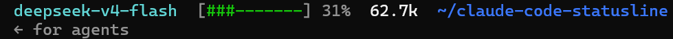

# Claude Code Status Line

> A custom status line for [Claude Code](https://claude.ai/code) — shows model name, context usage bar, token count, and current working directory.

[](#)
[](LICENSE)

---

## 📸 Preview



- **Model name** — cyan
- **Context bar** — green (0–40%), yellow (40–60%), red (60–100%)
- **Percentage** — context usage %
- **Tokens** — total input + output tokens
- **Working dir** — blue, `~`-shortened

---

## 🚀 Installation

```bash
# 1. Download the script
curl -Lo ~/.claude/statusline.py \
  https://raw.githubusercontent.com/Eliauk-Lik/claude-code-statusline/main/statusline.py

# 2. Add to ~/.claude/settings.json:
```

Add this to your `~/.claude/settings.json` (or project `.claude/settings.local.json`):

```json
"statusLine": {
    "type": "command",
    "command": "python3 ~/.claude/statusline.py"
}
```

No restart needed — the status line updates immediately.

---

## 🧪 Debug

If the status line shows `?` or something looks wrong:

```bash
python3 ~/.claude/statusline.py --debug
```

Debug info is written to stderr so it won't interfere with the status output.  
You can also inspect what data Claude Code passes by checking the sample JSON: run the script once with debug, or capture stdin directly:

```bash
# Save the JSON payload Claude Code sends
# (this requires running inside a Claude Code session)
```

---

## ⚙️ How It Works

Claude Code passes a JSON payload to the configured `statusLine` command via stdin every time the status refreshes. This script:

1. Reads and parses the JSON from stdin
2. Extracts: model name, context usage %, input/output tokens, working directory
3. Renders them as a single coloured line → stdout

The `statusLine` config in `settings.json` tells Claude Code to pipe its status JSON to this script and display the output.

---

## 📄 License

[MIT](LICENSE)

---

## 💡 Also See

- [Claude Code settings reference](https://docs.anthropic.com/en/docs/claude-code/settings)
- [Custom status lines](https://docs.anthropic.com/en/docs/claude-code/customization#custom-status-lines)

---

## 🇨🇳 中文说明

**Claude Code 状态栏插件** — 在终端底部显示模型名、上下文使用量进度条、Token 数和工作目录。

### 安装

```bash
# 1. 下载脚本
curl -Lo ~/.claude/statusline.py \
  https://raw.githubusercontent.com/Eliauk-Lik/claude-code-statusline/main/statusline.py

# 2. 在 ~/.claude/settings.json 中添加：
```

```json
"statusLine": {
    "type": "command",
    "command": "python3 ~/.claude/statusline.py"
}
```

### 显示效果


| 元素 | 颜色 | 说明 |
|------|------|------|
| 模型名 | 青色 | 当前使用的模型 |
| 进度条 `[#—]` | 绿/黄/红 | 0–40% 绿, 40–60% 黄, 60–100% 红 |
| 百分比 | 跟随进度条 | 上下文窗口使用率 |
| Token 数 | 白色 | 输入 + 输出总计（自动缩略：1.2k / 3.4M） |
| 工作目录 | 蓝色 | ~ 简化的当前路径 |

### 调试

```bash
python3 ~/.claude/statusline.py --debug
```

输出不正常的 `?` 时加 `--debug` 查看 parsed 字段值。
